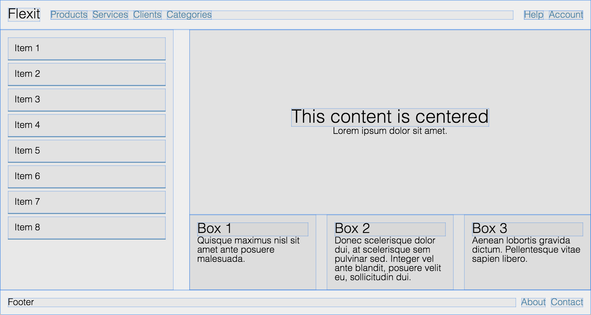

Flexit
======

Flexit is a small set of CSS classes for rapidly creating fixed height application layouts using CSS Flexbox.

If you want to use Flexit in production you need to consider browser support. CSS Flexbox is currently supported by the latest releases of all major browsers. For support in previous releases see: http://caniuse.com/#search=flexbox

##Usage
Flexit is intended for fixed height application layouts. If you are using it for a full screen application you need to set the height of the html and body tag to 100% by adding the class .hf to both. Flexit can also be used inside a single container, but it needs a fixed height.

Flexit has 2 container classes, .hbox will stack its children horizontally and .vbox vertically. Additional classes will add gap between children, padding, scrolling and center them horizontally or vertically (omg!). You can add the .flex class to containers that you want to grow to fill available space in the parent container.

```html
<!-- Set html to full height -->
<html class="hf">
  <!-- Set body to full height and stack children vertically -->
  <body class="hf vbox">
    <div>Header</div>
    <!-- Stack children horizontally, add gap between children, flex to push footer to the bottom of the page -->
    <div class="hbox hg4 flex">
      <div>Left column</div>
      <!-- Make right column take up available horizontal space, scroll if content overflows -->
      <div class="flex scroll">Right column</div>
    </div>
    <div>Footer</div>
  </body>
</html>
```

## Example
The example below (example.html) is created with Flexit. The body element has a .debug class that adds background color and border to all children to make it easier to debug your layout.



##Inspiration
Flexit is inspired the HBox and VBox containers in Adobe Flex (AS3) and OOCSS.
<a href="https://github.com/stubbornella/oocss/wiki" target="_blank">https://github.com/stubbornella/oocss/wiki</a>

## License
The MIT License (MIT)

Copyright (c) 2015 Bjørnar Stray Berentsen

Permission is hereby granted, free of charge, to any person obtaining a copy
of this software and associated documentation files (the "Software"), to deal
in the Software without restriction, including without limitation the rights
to use, copy, modify, merge, publish, distribute, sublicense, and/or sell
copies of the Software, and to permit persons to whom the Software is
furnished to do so, subject to the following conditions:

The above copyright notice and this permission notice shall be included in all
copies or substantial portions of the Software.

THE SOFTWARE IS PROVIDED "AS IS", WITHOUT WARRANTY OF ANY KIND, EXPRESS OR
IMPLIED, INCLUDING BUT NOT LIMITED TO THE WARRANTIES OF MERCHANTABILITY,
FITNESS FOR A PARTICULAR PURPOSE AND NONINFRINGEMENT. IN NO EVENT SHALL THE
AUTHORS OR COPYRIGHT HOLDERS BE LIABLE FOR ANY CLAIM, DAMAGES OR OTHER
LIABILITY, WHETHER IN AN ACTION OF CONTRACT, TORT OR OTHERWISE, ARISING FROM,
OUT OF OR IN CONNECTION WITH THE SOFTWARE OR THE USE OR OTHER DEALINGS IN THE
SOFTWARE.
